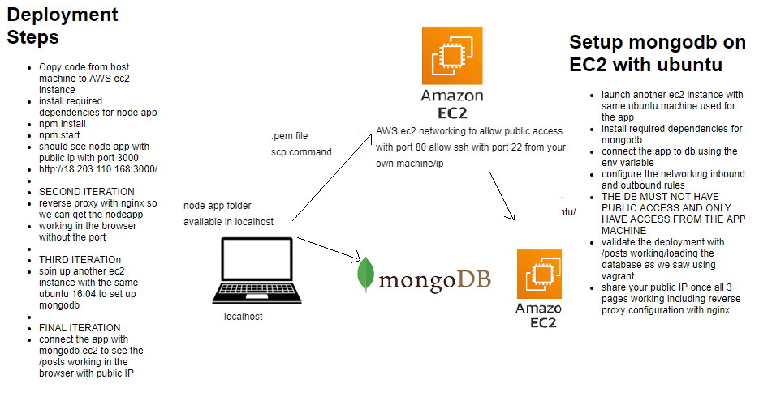

# AWS 2-Tier Architecture Node App Deployment with Mongodb Database



-  A 2-Tier architecture environment will be created to carry out all the functionalities of an application.
- This includes an EC2 instance for the database mongodb, and the EC2 instance to run the app.

## EC2 Instance (Node Application)
- Firstly we set up an ec2 instance with the following information.
#### AMI
`Ubuntu Server 16.04 LTS (HVM), SSD Volume Type`
#### Instance Type
`t2.micro`
#### Configure Instance Details
```
Network:   vpc-07e47e........6da (default)
Subnet:   subnet-042..........default1A
Auto-assign Public IP: Enable
```
#### Add Tags
``` 
Name: eng89_prathima_app
Description: Machine for running Application  
```
#### Configure Security Group 
- First Inbound protocol should be for the `SSH` at default port 22 and the localhost `IPV4`.
- `Custom TCP` at port 3000 to `Custom - 0.0.0.0/0` allow all to use in browser.
- ` HTTP` at port 80 to `Custom - ::/0` protocol also for global access.
- `SSH` at port 22 to `my ip - local-ip/32` for my use only
- `HTTP` at port 80 to `Custom - 0.0.0.0/0` for global access

### Running EC2 Instance and Installing Dependencies

- To get into instance on localhost, locate the folder were the ssh key is present.
- Sync the folder where application is present using the following command `scp -i pem_file_path -r app_file_path machine_name: file_name_in_instance`. For example `scp -i ~/.ssh/eng89_devops.pem -r app/ ubuntu@63.32.94.140:~/app/`
- Run the `chmod` command that can be found on aws by selecting the instance and pressing connect. The command is present under SSH Client. `chmod 400 eng89_devops.pem`
- SSH into machine and download the following dependencies one by one.

```
sudo apt-get update -y
sudo apt-get upgrade -y
sudo apt-get install nginx -y
sudo apt-get install git -y
sudo apt-get install python-software-properties -y
curl -sL https://deb.nodesource.com/setup_12.x | sudo -E bash -
sudo apt-get install nodejs -y
sudo npm install pm2 -g
```

#### Final Step (setting up a reverse proxy)
- A reverse Proxy can easily be setup by entering and configuring the default file in nginx.
```
cd etc/nginx/sites-available
rm -rf default
sudo nano default
```
- The default file should have the following present.
```
server{
       listen 80;
       server_name _;
       location / {
       proxy_pass http://db-ip:3000/;   # This proxy Must be Instance Public IP Address
   	   }
       location /posts {
       proxy_pass http://db:3000/posts;
       }
   }
```
- Restarting and enabling nginx
```
sudo systemctl restart nginx
sudo systemctl enable nginx 
```
- The app can now be run by entering the `App` folder and typing
```python
npm install
node app.js (or npm start)
```
- The app can now be seen on your AWS public IP Address with the extension :3000.

## EC2 Instance (Mongodb Database)
- Firstly we set up an ec2 instance with the following information.
### AMI
`Ubuntu Server 16.04 LTS (HVM), SSD Volume Type`
### Instance Type
`t2.micro`
### Configure Instance 
```
Subnet:   subnet ............default1A
Auto-assign Public IP: Enable
```
### Add Tags
``` 
Name: eng89_prathima_db
Description: Databse for node application.  
```
### Configure Security Group 
- First Inbound protocol should be for the `SSH` at default port 22 and the localhost `my IP`.
- `Custom TCP` at port 27017 to at node app instance IP Address for access to and from first EC2 instance with Node application.

### Running EC2 Instance and Installing Dependencies
- ssh into db by running by entering the commands from SSH Client from db ec2 instance via git bash.
- Once we are in the db EC2 instance, the dependencies to be installed as below:
```
sudo apt-key adv --keyserver hkp://keyserver.ubuntu.com:80 --recv D68FA50FEA312927
echo "deb https://repo.mongodb.org/apt/ubuntu xenial/mongodb-org/3.2 multiverse" | sudo tee /etc/apt/sources.list.d/mongodb-org-3.2.list
sudo apt-get update -y
sudo apt-get upgrade -y
sudo apt-get install mongodb-org=3.2.20 -y
sudo apt-get install -y mongodb-org=3.2.20 mongodb-org-server=3.2.20 mongodb-org-shell=3.2.20 mongodb-org-mongos=3.2.20 mongodb-org-tools=3.2.20
```
- We must now configure MongodB and restart the system. We do this via the following.
```python
cd /etc
sudo nano mongod.conf
net:
  port: 27017
  bindIp: 0.0.0.0
```
- We now restart Mongodb via `sudo systemctl restart mongod`
- We can check the Mongodb status via `sudo systemctl status mongod`

## Running Node App and MongoDb
Everything is set up. The Last steps are the following.
- Enter app node EC2 Instance an create env variable via `export DB_HOST' => 'mongodb://MongoDB_IP_ADDRESS:27017/posts`
- Enter app folder and seed data via `node seeds/seed.js`
- The app can now be seen running on the node app IP address with extension /Posts.

### we can check the application running on the browser with public ip address of EC2 instance of the node application by loading the data from the mongodb instance.
`http://ec2-app-public-ip:3000` & `http://ec2-app-public-ip:3000/posts`
